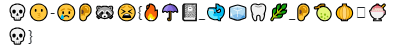

# Funny Message

> Points: 3

You were just hired as a junior crypto analyst. Your new boss, our Lead Cryptology Research Director, tasked you with your first challenge: decode this message: 

First crypto message was this emoji string:

Just write the first litter of the each emoji and you'll decode it:
* S - skull
* K - kiss
* C - cry
* E - ear
...

> flag: `SK-CERT{fun_with_emojis}`

# Noise

> Points: 3

> URL: https://drive.google.com/file/d/1DLdx1QANNu07hBSDnGjJElDGypyFiRBs/view?usp=sharing

Is the Lead Cryptology Research Director chasing ghosts? For your next challenge, he has attached a file containing noise along with the recipe used to create it. Can you retrieve the original text?