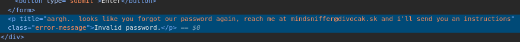
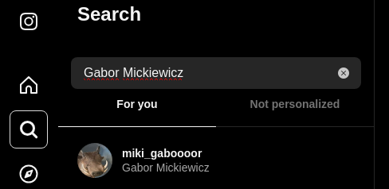
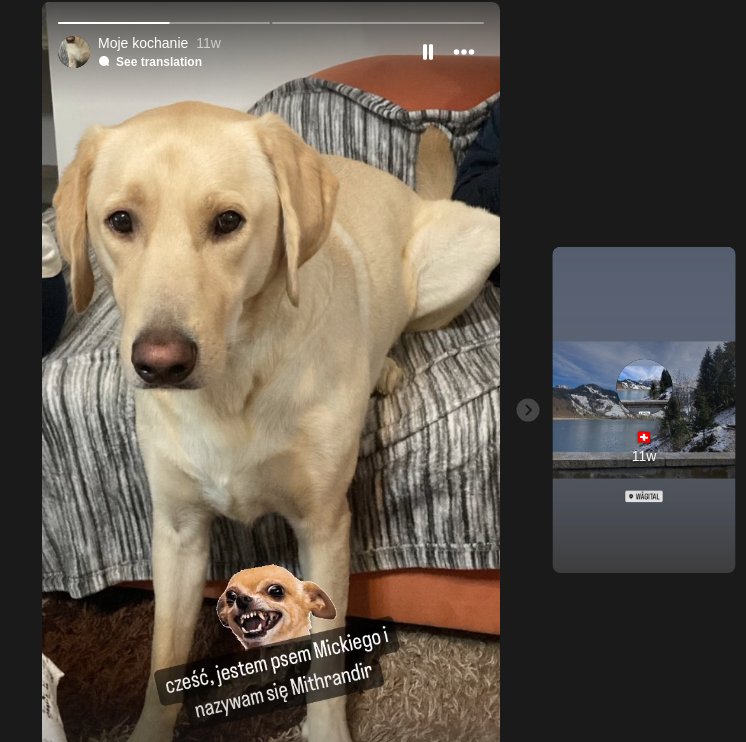
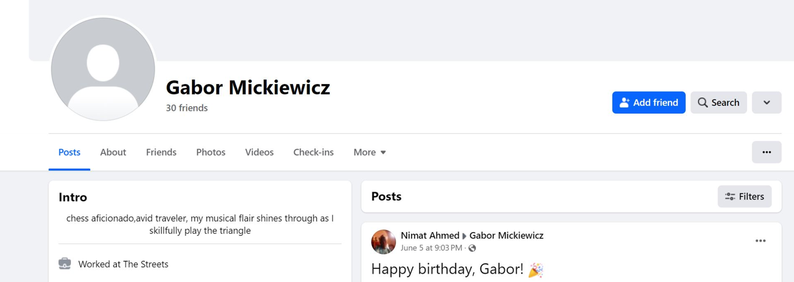
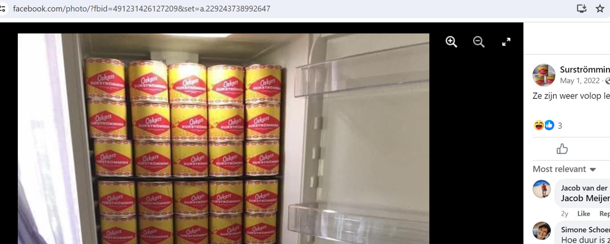
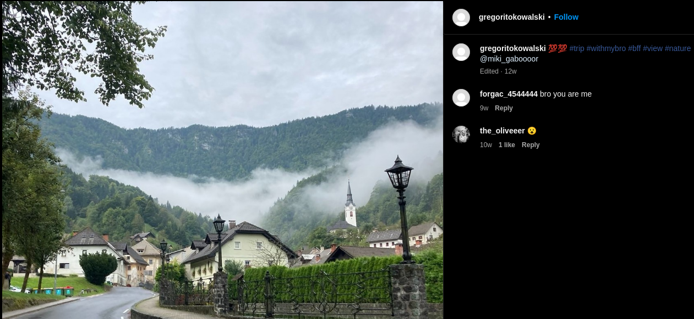
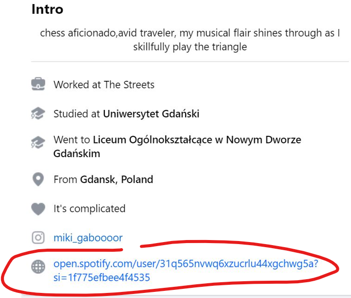
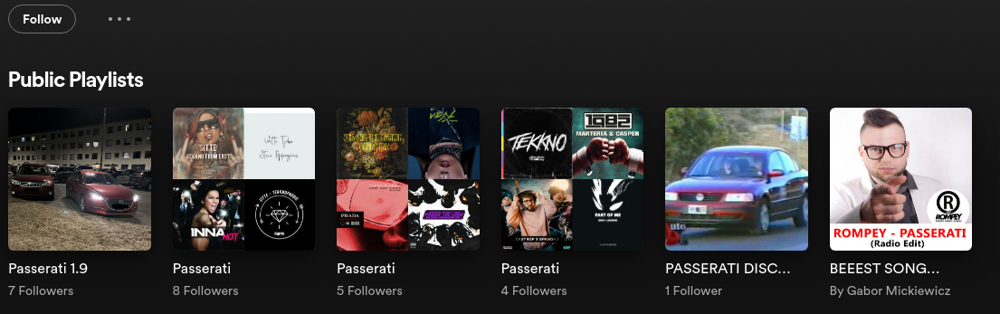
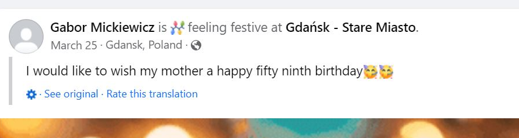
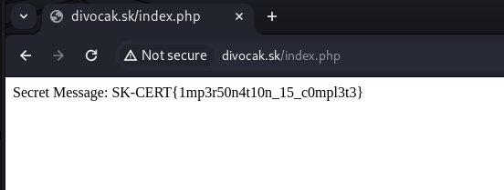

# Initial Contact

> Points: 3

> URL: http://divocak.sk/

The website provided is password protected, can you somehow access its content ? What will be your first step ?

Looking at the page source, we see following title after trying some random password:



Next step is to send email to `mindsniffer@divocak.sk` asking for password and we get following response:

```
Hello, Grzegorz is that u? Do you have a new mail? you know that you could contact me on FB but OK we con solve it via mail.. with KR, Gabor Mickiewicz
```
We replied that, yes, that is me, Gregorz and asked for password, after we got following reply:

```
OK but i must verify if it's really you, i will ask you couple of questions that only Grzegorz would know.  Tell my what is the name of my Dog
SK-CERT{4m_1_grz3g0rz_?}

```

So we have first flag, we learned mindsniffer's name is `Gabor Mickiewicz` and next step is to find name of his dog old fashioned OSINT way.

> flag: `SK-CERT{4m_1_grz3g0rz_?}`

# Question1

> Points: 3

We tried some techniques with prompt injection but it looks like this is not some "AI" bot but some more simpler "keyword" bot so we need to find the name of the dog.

Next step tried is finding `Gabor Mickiewicz` on social media sites. We start with Instagram and find his profile at: https://www.instagram.com/miki_gaboooor/. 



Here we found story with a dog where we found his name:



After replying "Mithrandir" to the email, we're getting flag with next question:

```
Yes thats true, my Dog is named Mithrandir. But that was easy, can you tell me what is my favourite food?
SK-CERT{d3ff1n1t3ly_l0tr_l0v3r}
```

> flag: `SK-CERT{d3ff1n1t3ly_l0tr_l0v3r}`

# Question2

After looking around Instagram account, we could not find anything related to food. We found [Instagram account of Grzegorz Kowalski](https://www.instagram.com/gregoritokowalski/), the person who Gabor thinks he's communicating with via email. Looking around Gregorz's account, we found they were on trip in Slovenija in village named Krupa (found via Google image search), we thought that there might me some restaurants there where they might made comments or ratings, but after several hours reading Google map reviews, there was nothing. 

Next step is to see if we can find Gabor on Facebook. Finding him was quick, although impossible without having an Facebook account. 



At Gabor's Facebook account, we find a lot of stuff, there is post about some cans of "oskars surströmming" where he commented how he likes it. 



After sending "oskars surströmming" via email, we got flag and next question:

```
Thats true i love those. But still easy.. because everybody loves surstromming. What was the name of village on our joint vacation ?
SK-CERT{50m3th1ng_5m3ll5_h3r3}
```

> flag: `SK-CERT{50m3th1ng_5m3ll5_h3r3}`

# Question3

Answer to name of the village is "Kropa" from the Instagram image post from Gregorz post which we heavily investigated and walked through whole village via street view.



Email response:
```
Yeah this Slovenia trip was great. Can you tell me what is the name of my favourite song?
SK-CERT{l1ttl3_v1ll4g3}
```
> flag: `SK-CERT{l1ttl3_v1ll4g3}`

# Question4

Answer to name of the best song is "passwerati" found on the Spotify link from Gabors Facebook page.





```
Is there a better song? i dont think so.. and let me ask you the final question and i give you password, how old will be my mother next year?
SK-CERT{mus1c_t45t3}
```
> flag: `SK-CERT{mus1c_t45t3}`

# Final

Answer to "how old will be my mother next year" is "60", found on Gabors FB post.



After this, password for the web page will be received and after entering password on `http://divocak.sk/`, will get last flag.



Email response:
```
Okay Grzegorz you passed all of my questions, i belive you my friend. Here is the password for website:$3creT__Pa$5WOr|)_0F_AAinDSN1fF3R
```

> flag: `SK-CERT{1mp3r50n4t10n_15_c0mpl3t3}`


