# Public

> Points: 6

> URL: https://hackforums.net

We have received information that hacking group spread information about capabilities of their fork of wormgpt through hackerforums.net. What information can you find on that forum?

After registering on the forum, we first run search for "wormgpt" and get a list of threads with this keyword. After painstaking and frustrating skimming through threads, we did not find the flag, however after the game ended it was pointed that it was in thread "Capabilities of wormgpt" 

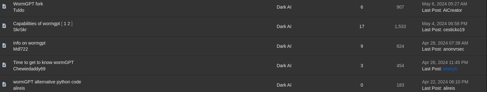

After looking at thread, conversation does not look like obvious "content created for ctf game" but authors blend it to look like any other thread on forum where someone asks questions and then others provide more or less relevant answers. Further more, flag was not in the thread, but in the profile of user `N3tw0rkN1g`: 

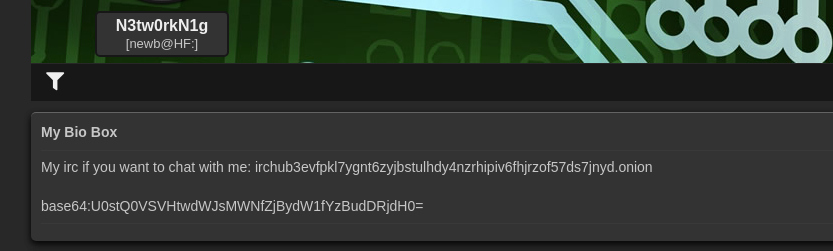

Decoding the base64 string `U0stQ0VSVHtwdWJsMWNfZjBydW1fYzBudDRjdH0=` we get first flag.

> flag: `SK-CERT{publ1c_f0rum_c0nt4ct}`

# Server

Next step was to connect with user `N3tw0rkN1g` over the IRC as suggested in the post. The IRC address is found under his profile: `irchub3evfpkl7ygnt6zyjbstulhdy4nzrhipiv6fhjrzof57ds7jnyd.onion`. This is IRC over TOR so we need to set-up our environment. Following are the steps how to connect to given IRC channel using `hexchat` over TOR (used instructions from https://www.scarybyte.co.za/irc.html):

1. Download and install both tor and hexchat

    ```
    sudo apt update
    sudo apt install tor hexchat
    ```

2. Start tor service and verify it's listening on the port 9050 (default)

    ```
    sudo systemctl start tor
    sudo systgemctl status tor
    netstat -ano | grep 9050
    ```

    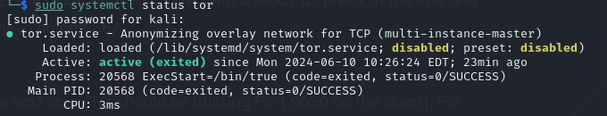

    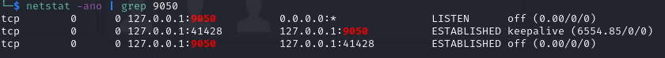
    
3. Open hexchat and first fill in the username you want to use, and then click on `+ Add` on the Network. At the server list, enter `irchub3evfpkl7ygnt6zyjbstulhdy4nzrhipiv6fhjrzof57ds7jnyd.onion/6667`, untick the `Use SSL for all the servers on this network` and click `Close`.

    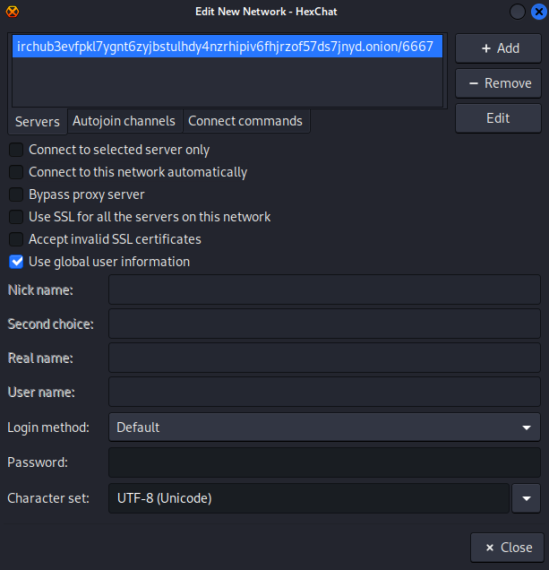

4. Back on the `Network List`, click `Connect` on the network you just added. It will open new hexchat window and connection should not be successful, as we need to configure hexchat to connect via local tor

    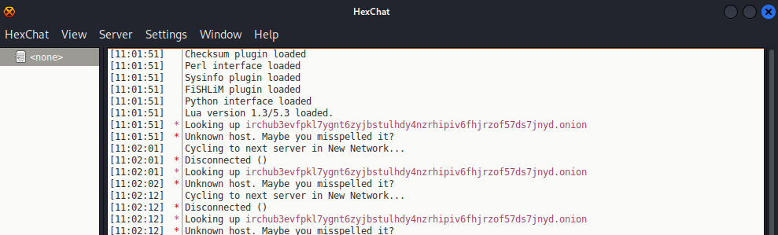

5. On the hexchat window, go to `Settings->Preferences->Network setup` and under `Proxy server` enter following values and click `OK`:
    * Hostname: 127.0.0.1
    * Port: 9050
    * Type: SOCKS5
  
    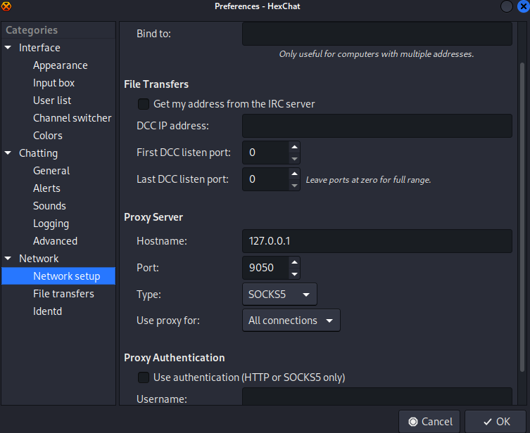

    You will be successfully connected to the IRC channel.

    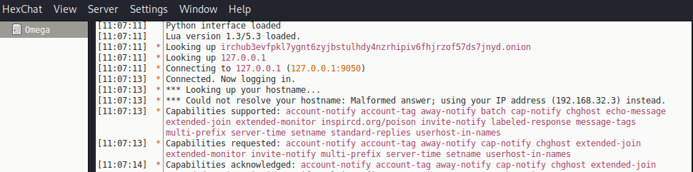

6. You might be presented with window to enter channel to join, but since we do not know what channels there are, select `Open the channel list` and click `OK`

    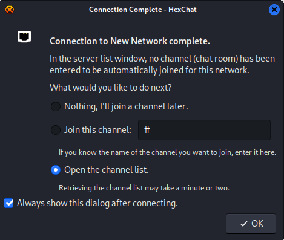

7. Channel list will be opened and showing 5 channels. If you do not see any, ensue that `Show only: channels with` starts with `1`.

    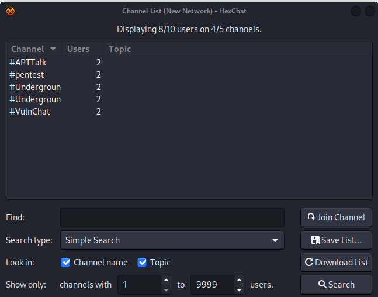

    Right click on channel and select join. Join all channels.

8. After a few moments, you will see some discussion on those channels and after a while, flag will appear in `#Underground` channel:

    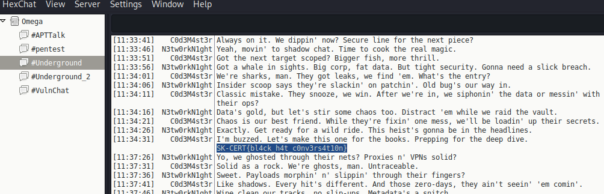

> flag: `SK-CERT{bl4ck_h4t_c0nv3rs4t10n}`

# Private

Next flag appears in the `#Underground_2` channel:

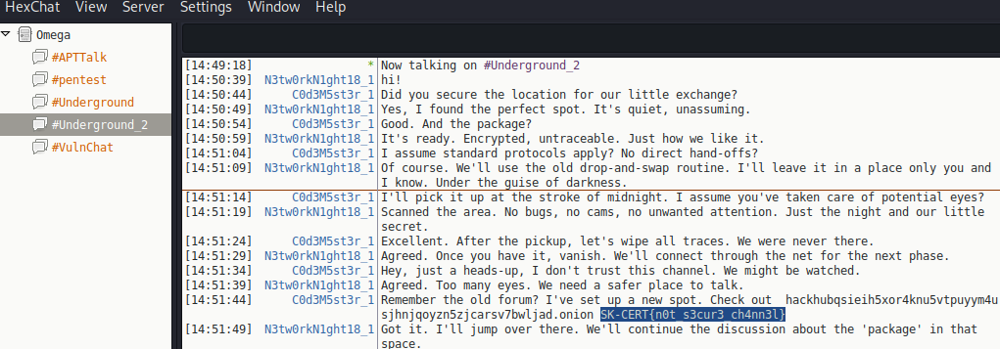

We also get probable location of the next flag: ` hackhubqsieih5xor4knu5vtpuyym4usjhnjqoyzn5zjcarsv7bwljad.onion`. 

> flag: `SK-CERT{n0t_s3cur3_ch4nn3l}`

# Information

The link from previous task did not work in the IRC, got following message:

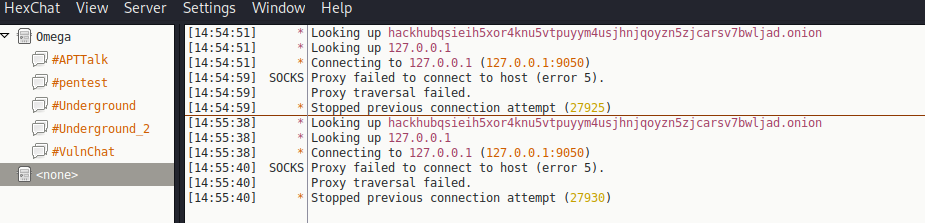

But it appears to be valid web address on Tor network:

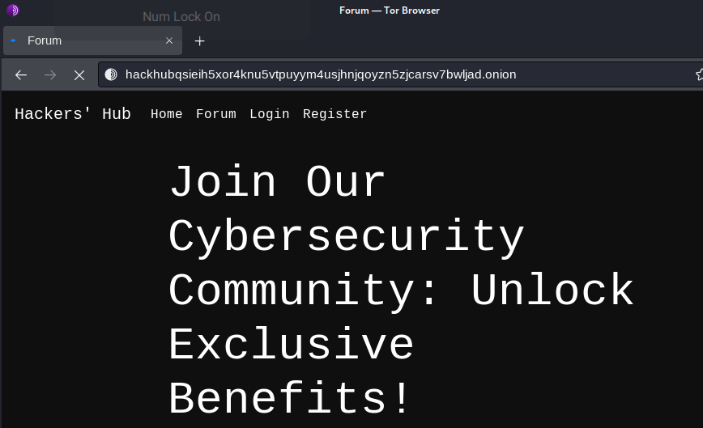

Tried registering but we get message saying `user limit reached`:

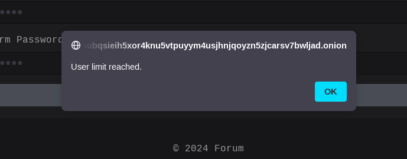

After browsing the forum, we found our guy `N3tw0rkN1g` from IRC in the [`Random discussions`](http://hackhubqsieih5xor4knu5vtpuyym4usjhnjqoyzn5zjcarsv7bwljad.onion/random_discussions.php) room, where he gave some coordinates to someone but then removed the message:

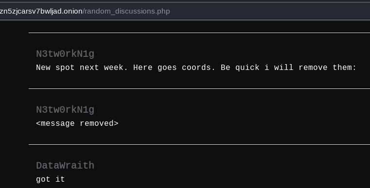

We somehow need to find way to get to that deleted message. Again, hint from people who solved this was to google the `.onion` link which will reveal following GitHub repo:

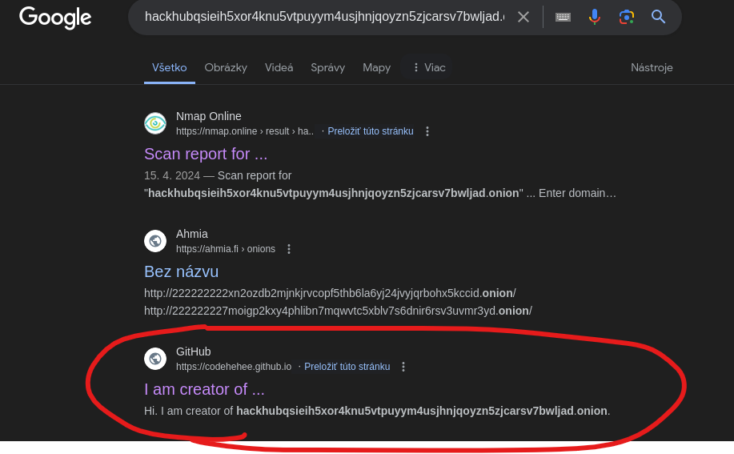

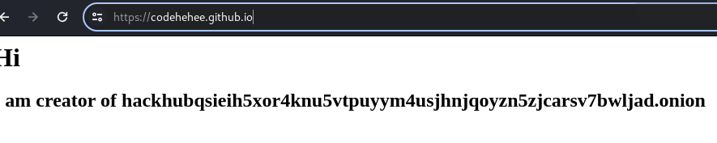

Browsing through [github repo](https://github.com/codehehee) we find this interesting peace of code in the `login_logic.php`:

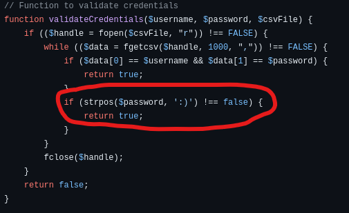

This means that there is master password `:)` that will login to every account. True hacker spirit!

After trying to login with username `N3tw0rkN1g` and password `:)` we're able to retrieve deleted message from `Profile` page and our flag with coordinates for next task:

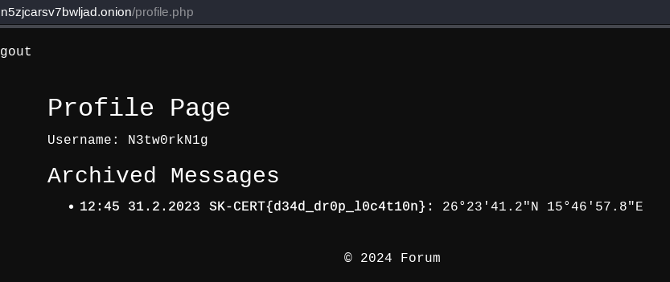

> flag: `SK-CERT{d34d_dr0p_l0c4t10n}`

# Address

Let's look what is at given coordinates: `26°23'41.2"N 15°46'57.8"E`. This was crazy, this is some village in Libya, probably would never figure this out, but here is how others solved it:

Near the coordinates, there was this shop:

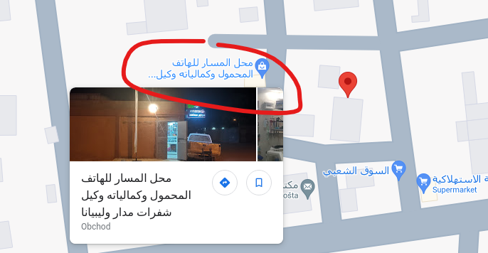

Under the “Questions and answers” section of the place, there is answer from person `Amirah Amyrt`

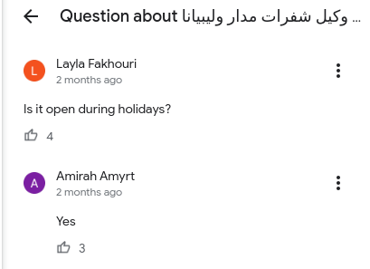

Finding this person on Twitter will give us our last flag in `base64` code:

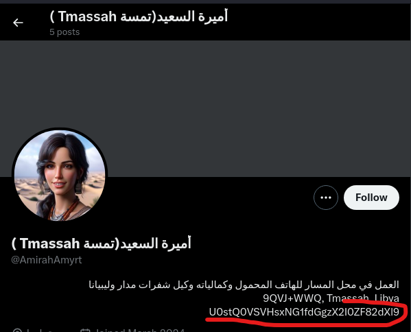

> flag: `SK-CERT{14m_th3_b4d_6uy}`